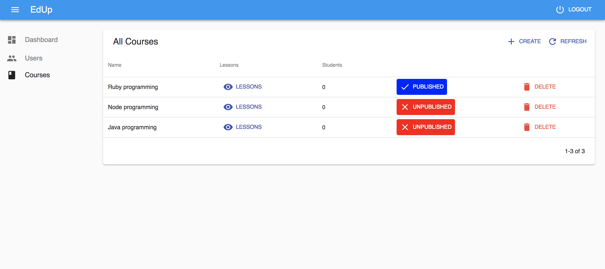
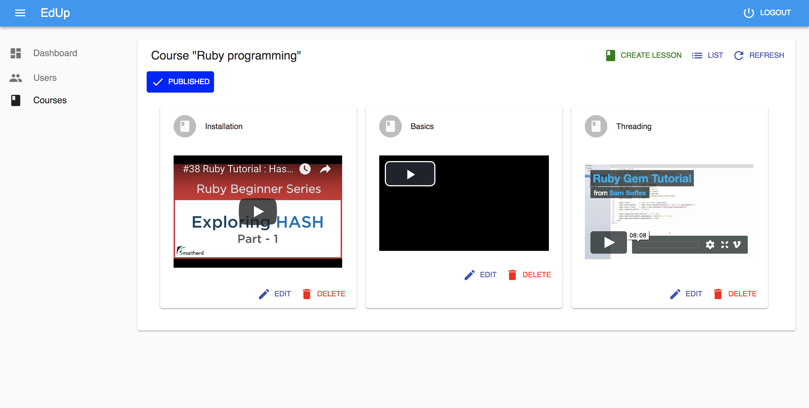
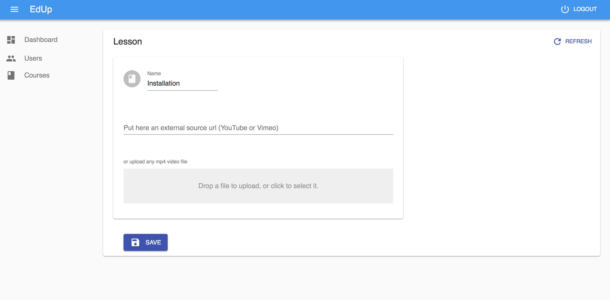
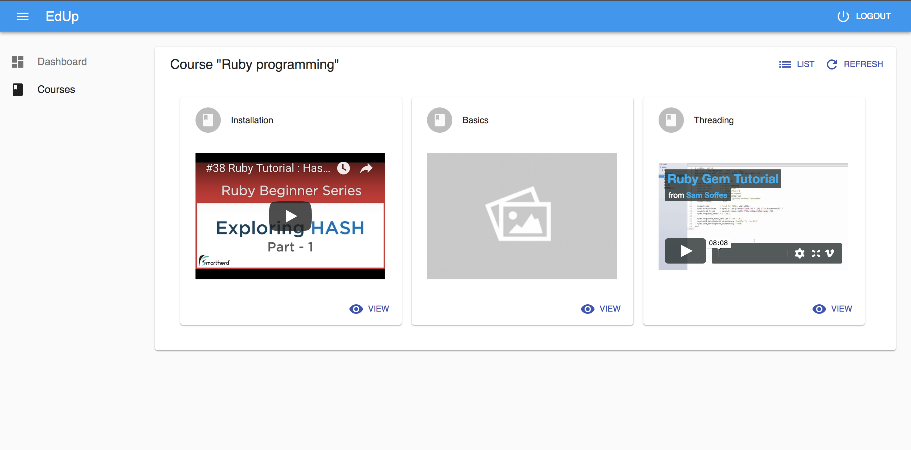
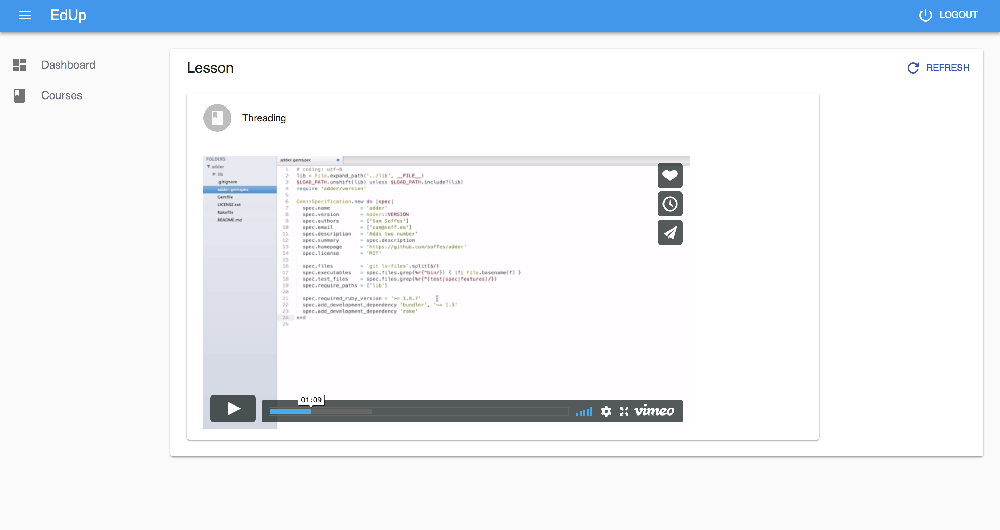

# EdUp

  * [EdUp API (backend)](https://bitbucket.org/leandronsp/edup/src/master/edup-api/README.md)
  * [EdUp Web (frontend)](https://bitbucket.org/leandronsp/edup/src/master/edup-web/README.md)

## Requirements

  * Ruby 2.5
  * Rails 5.2
  * PostgreSQL 10.5
  * Node v10.5.0
  * React 16

## Quickstart

  * [Download and install PostgreSQL](https://www.postgresql.org/download/) or use `brew install postgres` for OSX.
  * [Download NodeJS](https://nodejs.org/en/download/) or use `brew install nodejs`
  * Install Ruby 2.5

Running the API:
```
  cd edup-api/
  bundle install
  ./bin/rake db:reset db:migrate db:seed
  ./bin/rails s -p 4001
```
Running the frontend app:
```
  cd edup-web/
  yarn install
  yarn start
```

Open http://localhost:3000 and use credentials to perform the login.
```
# publisher
publisher@example.com

# student
student@example.com

# password
pa$$w0rd
```

## Screenshots

### As a publisher, manage the courses, create content and publish to students.



### Manage lessons and preview videos



### Change the lesson name at anytime, use an external url (YouTube and Vimeo accepted) or upload any mp4 video file



### As a student, see the lessons for a couse and preview the videos



### And view a specific video

