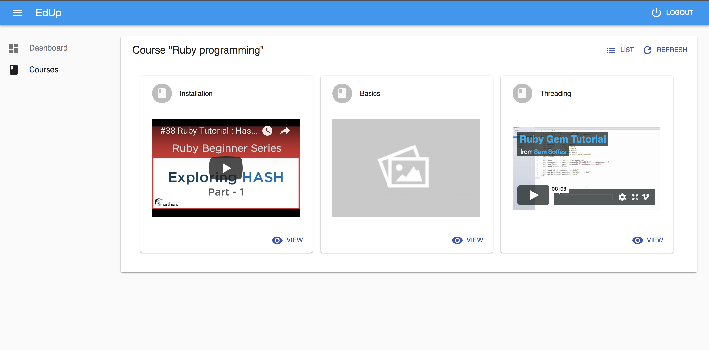

#EdUp

## As a publisher, manage the courses, create content and publish them to students.

## Manage lessons and preview videos

## Change the lesson name at anytime, use an external url (YouTube and Vimeo accepted) or upload any mp4 video file

## As a student, see the lessons for a couse and preview the videos

## And view a specific video

